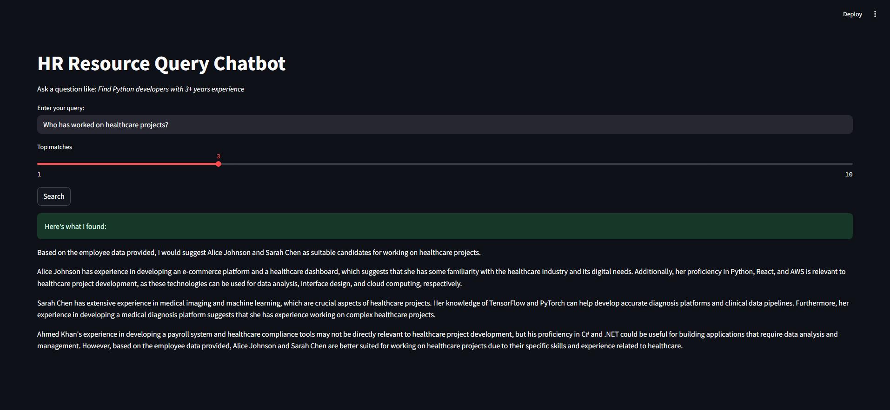

# HR Resource Query Chatbot

An AI-powered chatbot that helps HR teams quickly identify suitable employees based on natural language queries. Whether you're looking for "Python developers with 3+ years experience" or "someone who has worked on healthcare projects," this assistant retrieves the most relevant candidates and presents a detailed recommendation using a RAG (Retrieval-Augmented Generation) pipeline.

---

## Overview

This chatbot is designed to simplify resource allocation tasks for HR professionals by combining retrieval techniques with a local language model (LLaMA2 via Ollama). It takes unstructured, human-like queries and returns structured, insightful recommendations based on employee data such as skills, experience, and project history.

---

## Features

- Natural language query understanding
- RAG pipeline using embeddings + LLM generation
- FastAPI backend for clean RESTful APIs
- Streamlit frontend for interactive querying
- Embedding-based semantic search (FAISS)
- Dynamic response generation using LLaMA2 (local)
- Sample employee dataset with rich metadata
- API endpoints for chat and employee search
- Dark mode UI with adjustable top-K results

---

## Architecture

**System Components:**

```
User Input → Streamlit UI → FastAPI Backend
         ↓                            ↓
   Local LLM (LLaMA2) ← RAG Pipeline ← FAISS Vector Store
                                ↑
                      Employee Dataset (JSON)
```

- **Frontend**: Built with Streamlit for quick deployment and user interactivity
- **Backend**: FastAPI handles chat queries and search endpoints
- **Embeddings**: Sentence-transformers generate vector representations
- **Vector Search**: FAISS enables similarity search
- **LLM**: LLaMA2 (run locally via Ollama) generates natural responses

---

## Setup & Installation

### 1. Clone the Repository

```bash
git clone https://github.com/arunimakanavu/hr-resource-chatbot.git
cd hr-resource-chatbot
```

### 2. Set Up Virtual Environment

```bash
python -m venv venv
source venv/bin/activate  # On Windows: venv\Scripts\activate
```

### 3. Install Dependencies

```bash
pip install -r requirements.txt
```

### 4. Start the Backend API

```bash
uvicorn main:app --reload
```

### 5. Start the Streamlit Frontend

```bash
streamlit run interface.py
```

> Ensure that Ollama is installed and `llama2` model is pulled via:
> ```
> ollama pull llama2
> ```

---

## API Documentation

### `POST /chat`

**Description**: Accepts a user query and returns a list of recommended employees based on semantic similarity and LLM response.

**Request:**
```json
{
  "query": "Find React developers available for a new project",
  "top_k": 3
}
```

**Response:**
```json
{
  "response": "Based on your query, the top candidates are..."
}
```

---

### `GET /employees/search`

**Description**: Allows direct keyword-based employee search from the dataset.

**Parameters**:
- `skill` (optional)
- `availability` (optional)

**Example:**
```
GET /employees/search?skill=Python&availability=available
```

---

## AI Development Process

- **Tools Used**:
  - ChatGPT: architecture planning, code refactoring, embedding script generation
  - GitHub Copilot: autocompletion during module development
  - Ollama: for local LLM inferencing
- **AI Contribution**:
  - ~60% of the code (initial scaffolding, Streamlit layout, API handler logic)
  - ~40% hand-written (LLM tuning, bug fixes, Streamlit tweaks)
- **Interesting AI-Assisted Areas**:
  - Automatic generation of employee recommendation formatting
  - LLM prompt engineering for result personalization
- **Manual Solved Challenges**:
  - Token handling in embedding vector mismatch
  - Streamlit and FastAPI CORS/port syncing

---

## Technical Decisions

- **Open-Source over Cloud**: Opted for LLaMA2 via Ollama to allow offline, private, and cost-efficient development.
- **FastAPI**: Chosen for its async capabilities, auto-generated docs, and clean routing.
- **FAISS**: Lightweight and fast for in-memory vector similarity search.
- **Trade-offs**:
  - Local LLMs are slower than OpenAI API but eliminate API costs.
  - Streamlit was used over React for rapid development, but less customizable.

---

## Future Improvements

- Chat history with persona memory
- Upload your own employee CSV or JSON
- Admin dashboard for adding/updating employee profiles
- Docker containerization for deployment
- Online deployment via Streamlit Cloud or Render

---

## Demo


> Example Query: `"Who has worked on healthcare projects?"`  
> Returns: Based on the employee data provided, I would suggest Alice Johnson and Sarah Chen as suitable candidates for working on healthcare projects.

Alice Johnson has experience in developing an e-commerce platform and a healthcare dashboard, which suggests that she has some familiarity with the healthcare industry and its digital needs. Additionally, her proficiency in Python, React, and AWS is relevant to healthcare project development, as these technologies can be used for data analysis, interface design, and cloud computing, respectively.

Sarah Chen has extensive experience in medical imaging and machine learning, which are crucial aspects of healthcare projects. Her knowledge of TensorFlow and PyTorch can help develop accurate diagnosis platforms and clinical data pipelines. Furthermore, her experience in developing a medical diagnosis platform suggests that she has experience working on complex healthcare projects.

Ahmed Khan's experience in developing a payroll system and healthcare compliance tools may not be directly relevant to healthcare project development, but his proficiency in C# and .NET could be useful for building applications that require data analysis and management. However, based on the employee data provided, Alice Johnson and Sarah Chen are better suited for working on healthcare projects due to their specific skills and experience related to healthcare.
